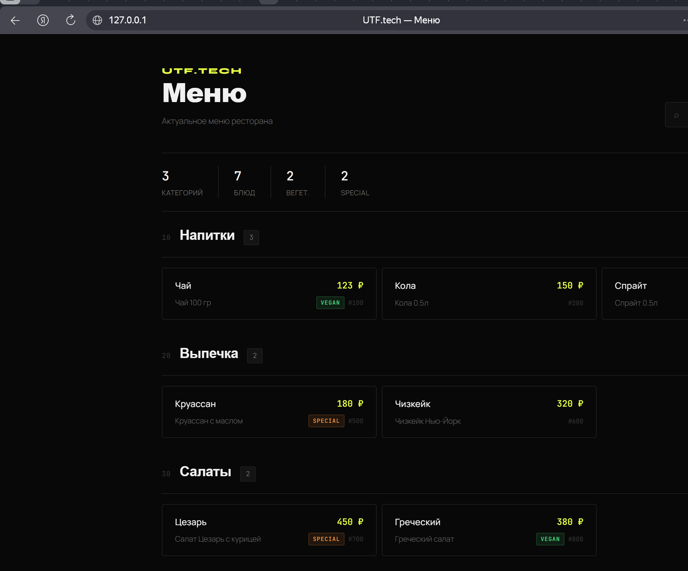
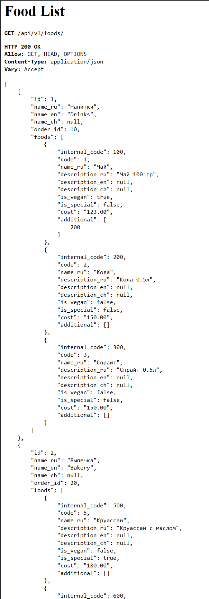

# UTF.tech Menu API TEST-CASE

View для ознакомления актуального меню: категорий и\из доступных блюд




#### - Python 3.12
#### - Django 6 + DRF
#### - PostgreSQL v16
#### - Docker / Docker Compose
#### - pytest / pytest-django


### Запуск
```bash
git clone <repository-url>
cd utf_case

docker compose up -d --build
```

API доступно по адресу `http://localhost:8000`

Web UI доступен по адресу `http://localhost`


## API

### Получить меню
```
GET /api/v1/foods/
```

Возвращает список непустых категорий с блюдами. В выборку попадают только опубликованные блюда (`is_publish=True`). Пустые категории без опубликованных блюд не попадают в выборку.


## Админ-панель


Создайте суперпользователя:
```bash
docker compose exec api python manage.py createsuperuser
```

Админка доступна по адресу `http://localhost:8000/admin/`

## Тесты
```bash
# Все тесты
docker compose exec api pytest /app/tests/ -v

# Тесты с отладочным выводом *print()
docker compose exec api pytest /app/tests/ -v -s

# ИЛИ
docker compose exec api pytest /app/tests/integration/test_food_api.py -v
```

## Дополнительно

Миграции:
```bash
# Создать миграции
docker compose exec api python manage.py makemigrations

# Применить миграции
docker compose exec api python manage.py migrate
```